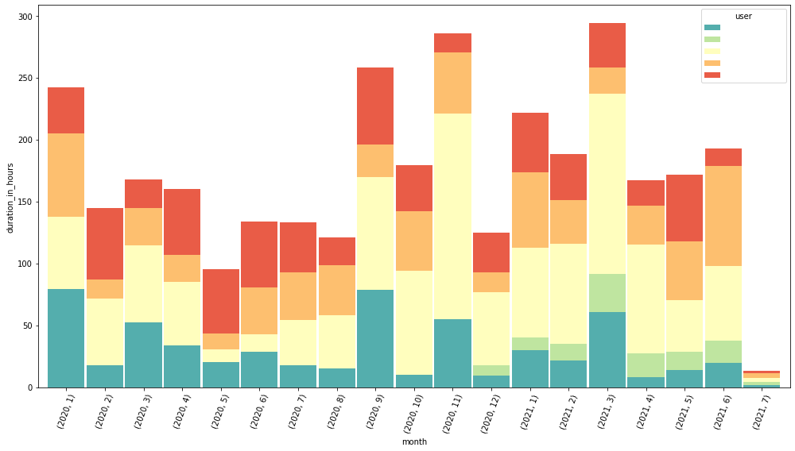

# How to use it

* Download your netflix data [netflix.com/account/getmyinfo](https://www.netflix.com/account/getmyinfo)
* Put the file `ViewingActivity.csv` in a directory named `private`
* Play around with the notebook `plotting.ipynb`

## Output example
One of the possible things to inspect is watch times per user over time.

## Question: Why is this a notebook?
Answer: I like notebooks.